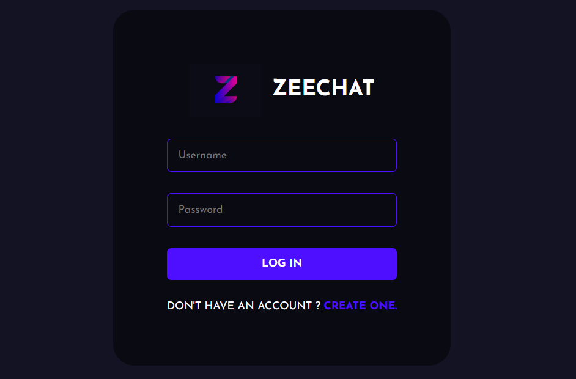
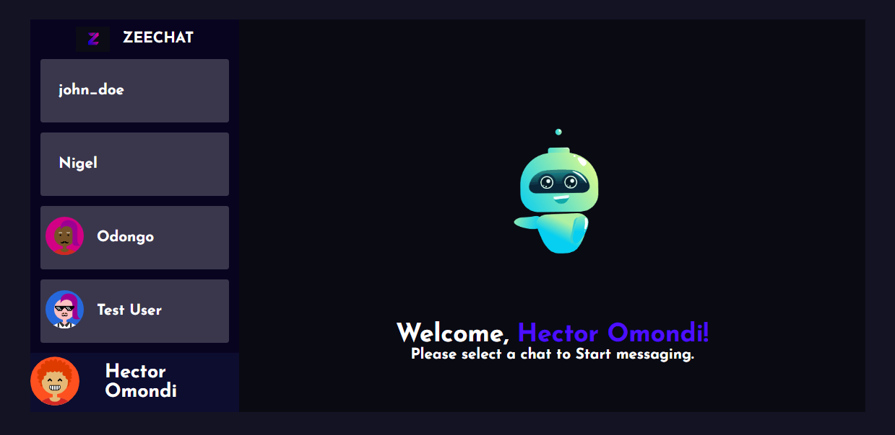
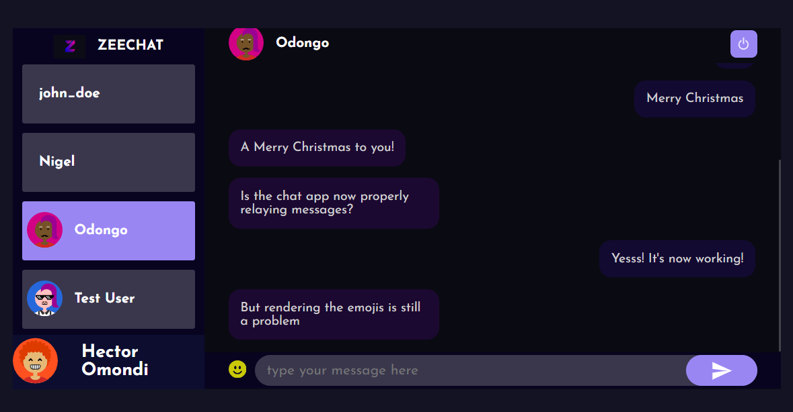
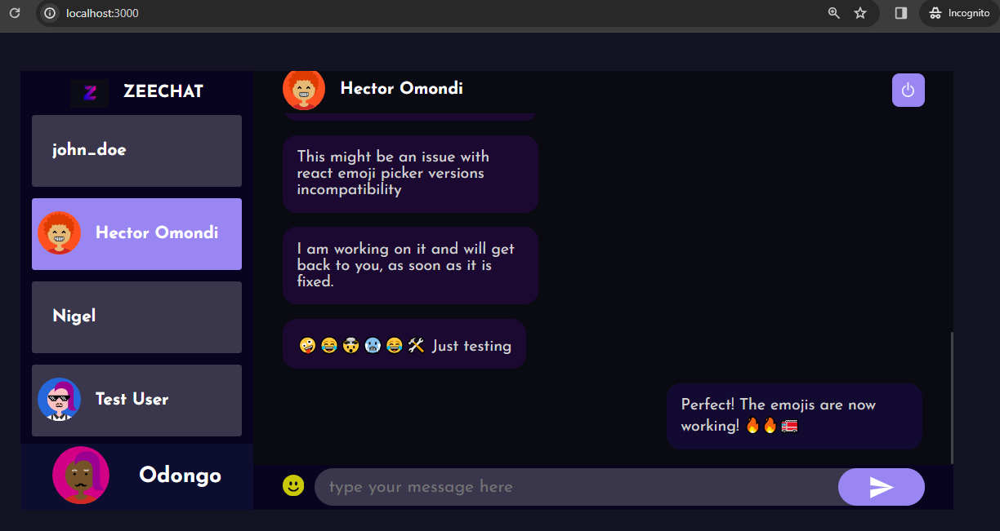

# ZeeChat - Chat Application 
ZeeChat is a chat application that I built with the power of MERN Stack.










## Installation Guide

### Requirements
- [Nodejs](https://nodejs.org/en/download)
- [Mongodb](https://www.mongodb.com/docs/manual/administration/install-community/)

Both should be installed and make sure mongodb is running.

```shell
git clone  https://github.com/NigelOmondi/CHAT-APP
cd chat-app-react-nodejs
```
Create your .env files for both frontend and server folders

Now install the dependencies
```shell
cd server
npm install
cd ..
cd frontend
npm install
```
We are almost done, Now just start the development server.

For Frontend.
```shell
cd frontend
npm start
```
For Backend.

Open another terminal in folder, Also make sure mongodb is running in background.
```shell
cd server
npm run dev
```

Done! Now open localhost:3000 in your browser.
